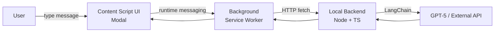

# アーキテクチャ概要（Step1中心）

---

## 全体像
- Chrome拡張（Plasmo）が特定サイト上にモーダルUIを表示し、ユーザー入力を受け付ける
- 拡張のBackgroundが、ローカルBackendへHTTPで問い合わせる
- Backendが LangChain + GPT-5 を使って外部APIへアクセスし、返答を返す

---

## 主要な設計ポイント
- **外部ネット通信はBackendのみ**：APIキー管理・セキュリティのため
- **Front↔Backの境界をAPIで固定**：Step2で接続先を差し替えやすくする
- 型は `packages/shared` を正として共有し、破壊的変更を避ける
